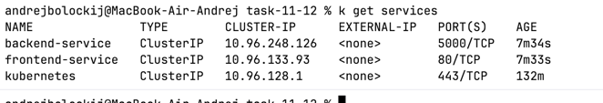
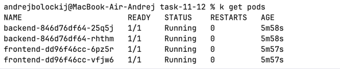

# Практические работы №11-12


## Часть 1

Если Ingress Controller отсутствует, установите:
```bash
./deploy-ingress.sh
```


### Развертывание

Используя скрипт:
```bash
./deploy-kubectl.sh
```

### Удаление ресурсов

Используя скрипт:
```bash
./cleanup-kubectl.sh
```

Или вручную:
```bash
kubectl delete -f manifests/
```

### Артефакты







