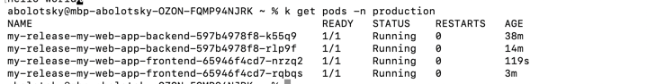
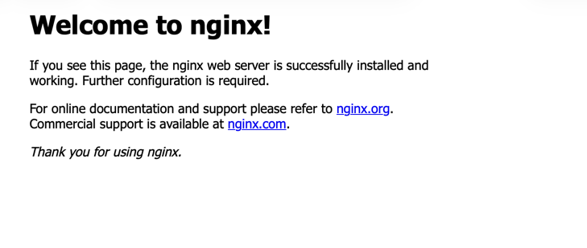

# Практические работы №11-12


## Часть 1

Если Ingress Controller отсутствует, установите:
```bash
./deploy-ingress.sh
```


### Развертывание через kubectl

Используя скрипт:
```bash
./deploy-kubectl.sh
```

### Удаление ресурсов

Используя скрипт:
```bash
./cleanup-kubectl.sh
```

Или вручную:
```bash
kubectl delete -f manifests/
```

## Часть 2. 

### Развертывание ingress

```bash
helm repo add ingress-nginx https://kubernetes.github.io/ingress-nginx
helm repo update
helm install ingress-nginx ingress-nginx/ingress-nginx -n ingress-nginx --create-namespace

kubectl get svc -n ingress-nginx
```

### Развертывание через helm

```bash
helm upgrade my-release ./helm-charts/my-web-app -n production --create-namespace
```

### Артефакты

#### Часть 1


#### Часть 2







