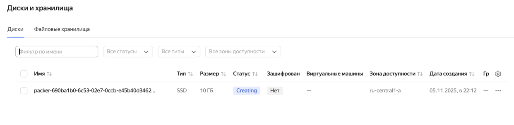
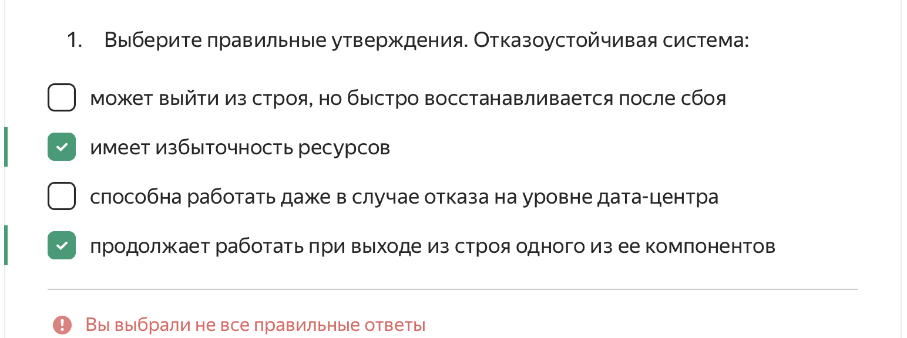
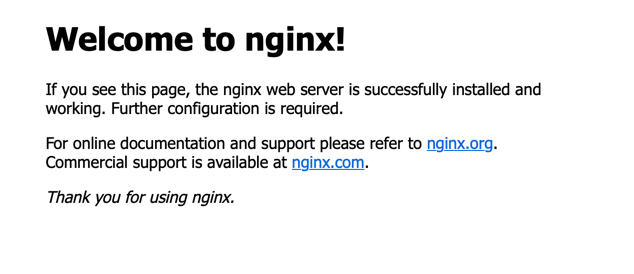

# Task 6

Команда для запуска

```commandline
packer build  -var="subnet_id=YC_SUBNET_ID" -var="folder_id=YC_FOLDER" -var="token=YC_TOKEN" -var="ssh_public_key_path=SSH_PATH" packer.pkr.hcl
```

## Yandex Cloud данные
- folder_id: `yc resource-manager folder list`
- subnet_id: `yc vpc subnet list` 
- token: `yc iam create-token`

## Артефакты

Созданный диск



Созданная ВМ



nginx



ответ от flask сервера


