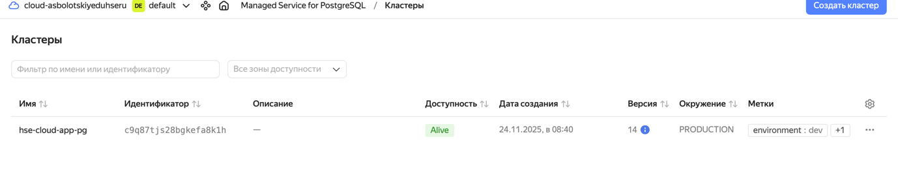
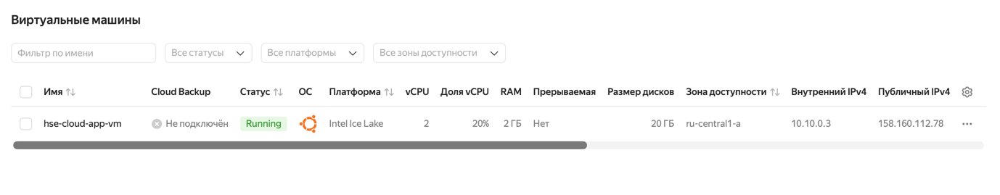
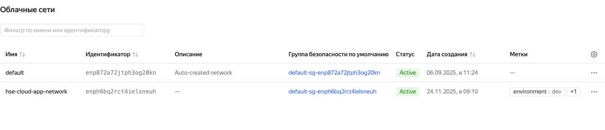
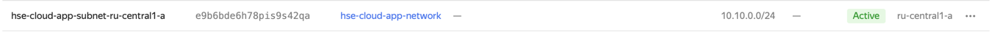

# Домашняя работа №8

## Артефакты

### Managed PostgreSQL

### ВМ

 
### Сети

## Предварительные требования

Провайдер Terraform берёт `token`, `cloud_id` и `folder_id` из настроек `yc` или переменных окружения `YC_TOKEN`, `YC_CLOUD_ID`, `YC_FOLDER_ID`.